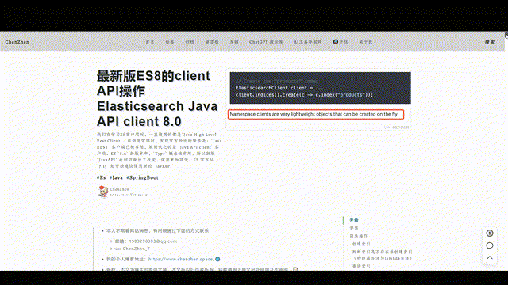
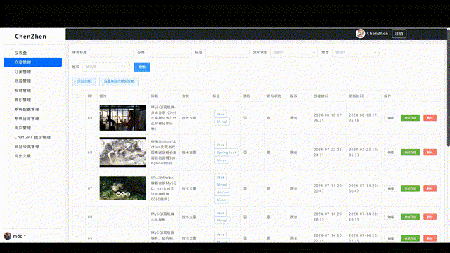

# ChenZhen's Blog
# 项目展示
地址：[https://www.chenzhen.space/](https://www.chenzhen.space/)

# 项目简介
该博客是之前博客（[https://www.chenzhen.space/blog/34](https://www.chenzhen.space/blog/34 )）的一个2.0改造版本，对前端进行了全面的翻新！改用了`bootstrap`作为前端`css`框架，更加简约、美观，并且对项目的后台使用`vue` + `axios`进行了重构，框架进行重新选型，仍然基于SpringBoot并且使用`sa-token`进行鉴权，博客的模板引擎还是使用`thymeleaf`（SEO优化友好）。

博客更新了很多实用的功能，并且后续会以能够开源的标准进行开发，代码全部开源，并且这次会作为稳定的版本持续的维护下去。

该博客作为一个刚学习`springboot`的`java`程序员而言是非常适合入门学习的一个项目，因为所用框架都是比较主流的开发框架，并且整个博客项目涵盖了前端、后端开发、域名购买、项目部署、CDN配置等等，知识全面，难度偏中等，当你完成后还可以得到属于自己的一个博客，非常推荐个人学习。

每个技术人都应该有属于自己的博客！相比较直接使用第三方博客平台，自行搭建博客更有成就感；另外就是没有平台限制，比如你想发个二维码引流啥的，平台基本都是不允许的，还有，你可以自由 div 定制自己想要的博客 css 样式，哪天 UI 看不爽了，咱就自己换；

最后，面试的时候，如果简历贴上的是自己开发博客地址，也会很加分！

项目制作不易，如果对你有帮助，请给一个小小的star⭐支持一下

# 运行
下载源码，创建数据库`cz-blog`,在该数据库上执行sql文件创建数据表，然后修改application-dev.yml文件中连接数据库的用户名、密码。运行项目即可。数据库版本Mysql8以上。

前端访问地址：http://localhost:8188

后台访问地址：http://localhost:8188/admin 用户名：admin 密码：123456

yaml中的邮箱地址和授权码，具体怎么配置可以看我博客文章 [https://www.chenzhen.space/blog/28](https://www.chenzhen.space/blog/28 )，如果没有配置则邮件通知功能不会生效。

# 技术栈
项目无需安装除数据库外的任何中间件，直接运行即可。后台采用前后端分离的开发模式，前端使用Vue + Bootstrap5，后端使用SpringBoot + Mybatis进行开发， 博客页面使用Thymeleaf作为模板引擎，利好SEO优化，数据库使用mysql8。 

## 前端
JS框架： Vue

CSS框架：Bootstrap5

Markdown编辑器：editormd

代码高亮： prism

目录生成：Tocbot

## 后端
整体使用springboot + Thymeleaf + Mybatis进行开发

核心框架：SpringBoot 2.7.3

持久层框架：MybatisPlus

模板框架：Thymeleaf

分页插件：PageHelper

数据库：mysql8

工具包：Hutool

鉴权框架：Satoken

参数校验：hibernate-validator

# 功能模块
## 博客主页
1. 首页：博客列表、推荐文章、点击量、评论数、站长个人信息（QQ、微信、邮箱、地址）、网站总浏览量、较昨日浏览量增长量、博文总数、评论总数、留言总数
2. 文章详情页：Github同款文章内容排版和样式，自动生成文章目录、评论区、相似度文章推荐、悬浮条、博客赞赏码、版权声明
3. 音乐播放器：支持上传音乐和播放音乐、播放、暂停、调整音量
4. 自动申请友情链接：在线申请友情链接，无需站长手动配置，只需申请方添加完站长的连接后自行申请即可
5. 友链：申请友链、友链审核通过/拒绝邮件提醒，定时任务扫描友链网络情况打上绿黄红标签
6. 百度推送：接入支持百度推送API，可以一键推送博文到百度搜索引擎，提高博客的SEO，加速百度搜索引擎收录博文
7. 文章搬运工：集成CSDN的API 实现“文章搬运工”功能，支持一键同步csdn上自己已经发布的文章，可抓取列表和单个文章
8. 评论区：访客在留言板和每一篇文章底部可以发表评论，管理员评论有特殊标记，管理员可删除评论区的任意评论。
9. 邮件通知功能：回复评论，并且会向回复对象、以及被回复时发送提醒邮件。点击评论者头像可以跳转到该评论者的博客。
10. 自定义网站内容：管理员可自定义“关于本站”、“技能”、“站长名”、“关于我”等内容，可自由编辑，修改后立即生效。
11. 流控：针对异常IP的连续大量访问，系统会自动封禁该IP。
12. 系统日志：记录用户操作日志、异常日志、访问日志等，可方便管理员查看系统运行日志。

## 移动端响应式布局

