# ChenZhen's Blog
# 项目简介
该博客是之前博客（[https://www.chenzhen.space/blog/34](https://www.chenzhen.space/blog/34 )）的一个2.0改造版本，对前端进行了全面的翻新！改用了`bootstrap`作为前端`css`框架，更加简约、美观，并且对项目的后台使用`vue` + `axios`进行了重构，框架进行重新选型，仍然基于SpringBoot并且使用`sa-token`进行鉴权，博客的模板引擎还是使用`thymeleaf`（SEO优化友好）。

博客更新了很多实用的功能，并且后续会以能够开源的标准进行开发，代码全部开源，并且这次会作为稳定的版本持续的维护下去。

该博客作为一个刚学习`springboot`的`java`程序员而言是非常适合入门学习的一个项目，因为所用框架都是比较主流的开发框架，并且整个博客项目涵盖了前端、后端开发、域名购买、项目部署、CDN配置等等，知识全面，难度偏中等，当你完成后还可以得到属于自己的一个博客，非常推荐个人学习。

每个技术人都应该有属于自己的博客！相比较直接使用第三方博客平台，自行搭建博客更有成就感；另外就是没有平台限制，比如你想发个二维码引流啥的，平台基本都是不允许的，还有，你可以自由 div 定制自己想要的博客 css 样式，哪天 UI 看不爽了，咱就自己换；

最后，面试的时候，如果简历贴上的是自己开发博客地址，也会很加分！

项目制作不易，如果对你有帮助，请给一个小小的star⭐支持一下

# 运行
下载源码，创建数据库`cz-blog`,在该数据库上执行sql文件创建数据表，然后修改application-dev.yml文件中连接数据库的用户名、密码。运行项目即可。数据库版本Mysql8以上。

前端访问地址：http://localhost:8188

后台访问地址：http://localhost:8188/admin 用户名：admin 密码：123456

yaml中的邮箱地址和授权码，具体怎么配置可以看我博客文章 [https://www.chenzhen.space/blog/28](https://www.chenzhen.space/blog/28 )，如果没有配置则邮件通知功能不会生效。

# 技术栈
## 前端
JS框架： Vue

CSS框架：Bootstrap5

Markdown编辑器：editormd

代码高亮： prism

目录生成：Tocbot

## 后端
整体使用springboot + Thymeleaf + Mybatis进行开发

核心框架：SpringBoot 2.7.3

持久层框架：MybatisPlus

模板框架：Thymeleaf

分页插件：PageHelper

数据库：mysql8

工具包：Hutool

鉴权框架：Satoken

参数校验：hibernate-validator

# 功能模块
## 博客主页
1. 首页：博客列表、推荐文章、点击量、评论数、站长个人信息（QQ、微信、邮箱、地址）、网站总浏览量、较昨日浏览量增长量、博文总数、评论总数、留言总数
2. 文章详情页：Github同款文章内容排版和样式，自动生成文章目录、评论区、相似度文章推荐、悬浮条、博客赞赏码、版权声明
3. 音乐播放器：支持上传音乐和播放音乐、播放、暂停、调整音量
4. 搜索：按照关键词匹配文章列表
5. 标签：可以查看所有标签、各个标签对应的文章
6. 归档：可以按发布时间顺序查看每一篇文章
7. 评论区：访客在留言板和每一篇文章底部可以发表评论，管理员评论有特殊标记，管理员可删除评论区的任意评论。
8. 邮件通知功能：回复评论，并且会向回复对象、以及被回复时发送提醒邮件。点击评论者头像可以跳转到该评论者的博客。
9. 友链：申请友链、友链审核通过/拒绝邮件提醒，定时任务扫描友链网络情况打上绿黄红标签
10. 关于我：在这里查看栈主的个人信息，后台可以修改配置不需要改动代码
11. 底部栏：网站的总运行时间、备案号

## 管理后台
1. 登录：使用satoken对管理员身份进行验证，拦截所有非管理员访问后台相关页面，管理员登录后拥有管理权限，能在后台管理页面对博客、标签和友链进行管理
2. 博客管理：查询文章、写文章、编辑文章、删除文章、保存草稿。
3. 分类管理：添加分类、删除分类、修改分类、查询分类。
4. 标签管理：添加标签、删除标签、修改标签、查询标签。
5. 音乐管理：上传音乐、删除音乐、修改音乐、查询音乐。
6. 友链管理：添加友链、删除友链、修改友链、审核友链。
7. 系统参数管理：站点概览、站长名称、关于我内容的编辑、技能
8. 同步文章：已对接CSDN，可查看CSDN博文列表，一键同步文章到本地博客

# 项目展示
地址：[https://www.chenzhen.space/](https://www.chenzhen.space/)

## 首页1
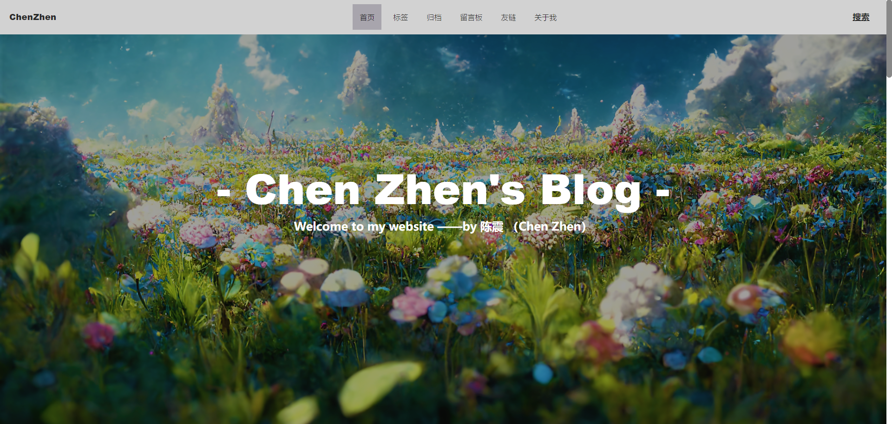

## 首页2
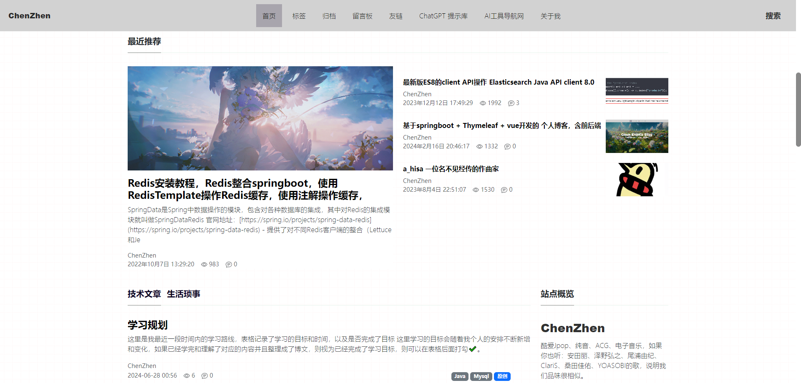

## 首页3
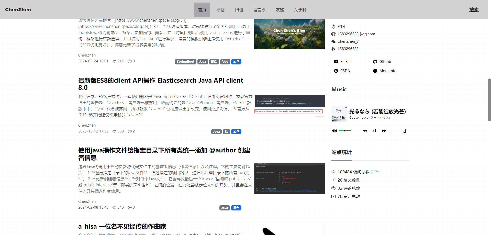
## 音乐播放器
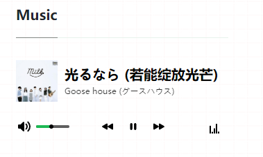
## 文章详情页1
文章内容和目录
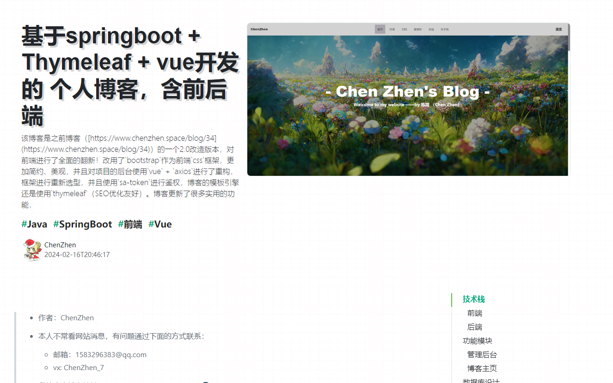
## 文章详情页2
底部推荐文章和文章评论区
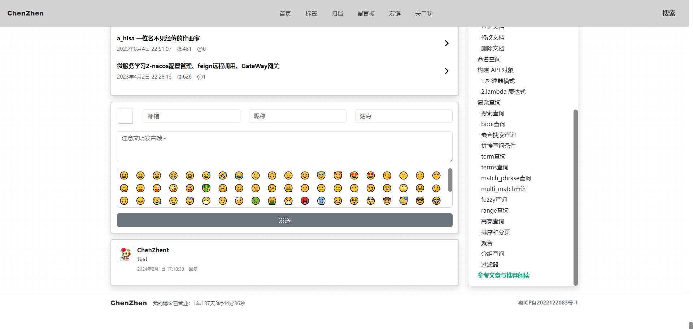
## 赞赏
文章赞善码
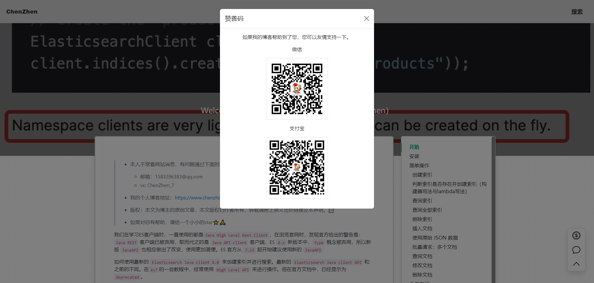
## 搜索
关键词搜索
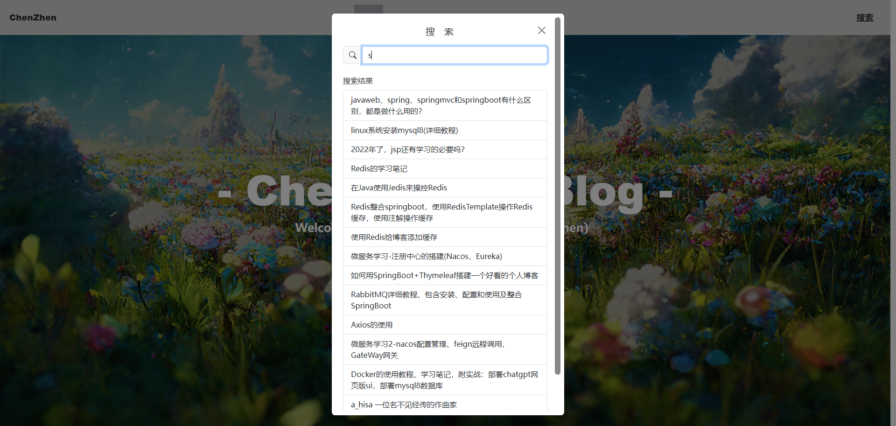
## 文章标签页
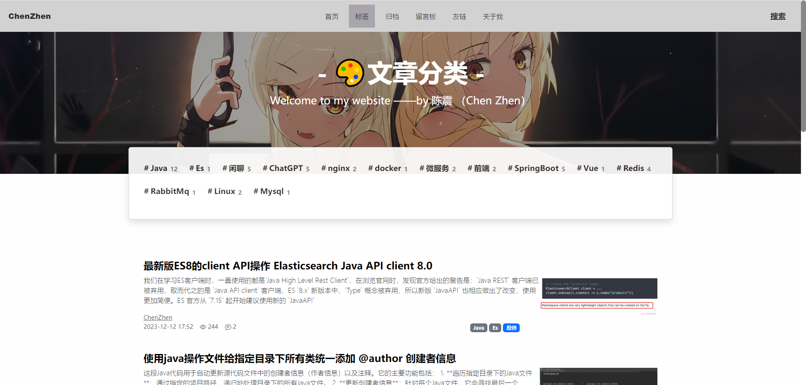
## 友链2
友链申请，后台审核后可以留下友链
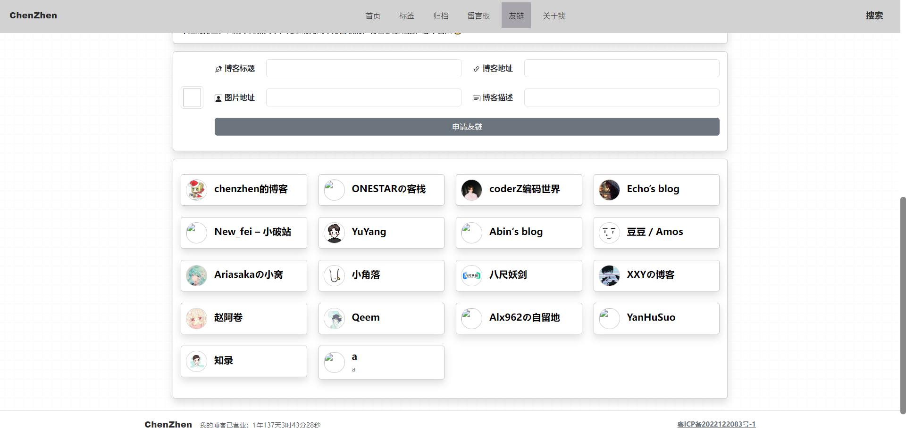
## 关于我
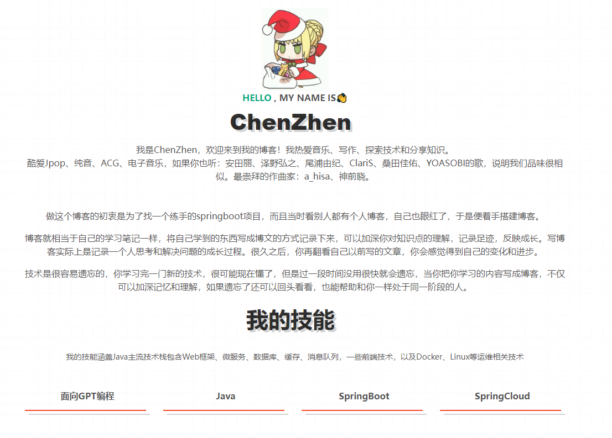
## 后台登录界面
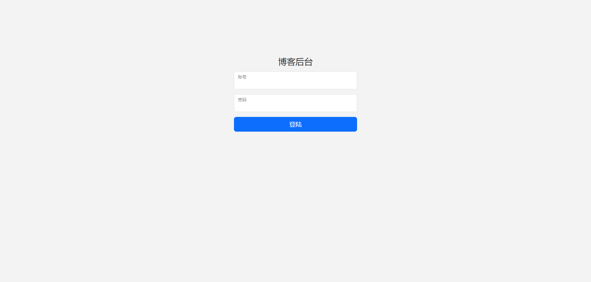
## 文章管理
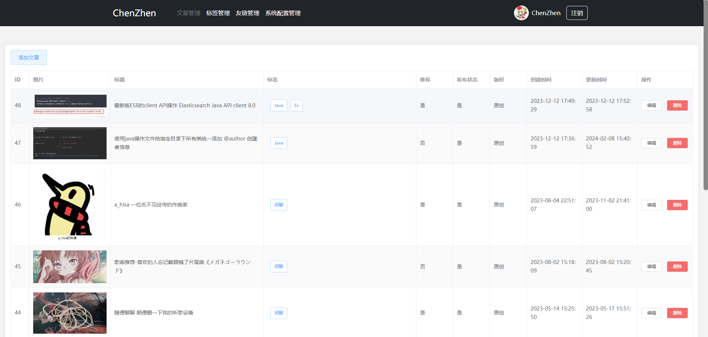

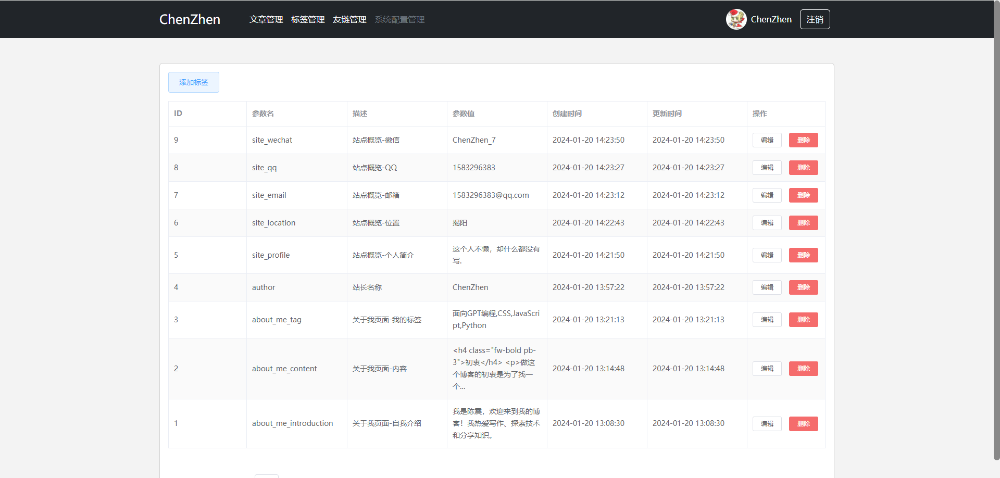
## 编辑文章
主流markdown编辑器
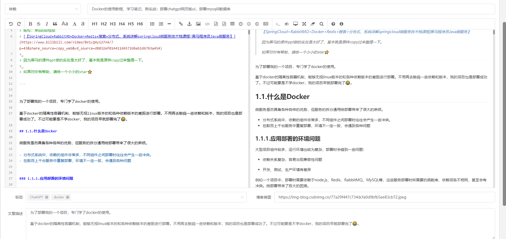
## 移动端响应式布局
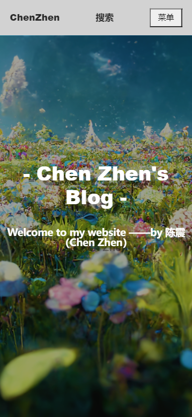

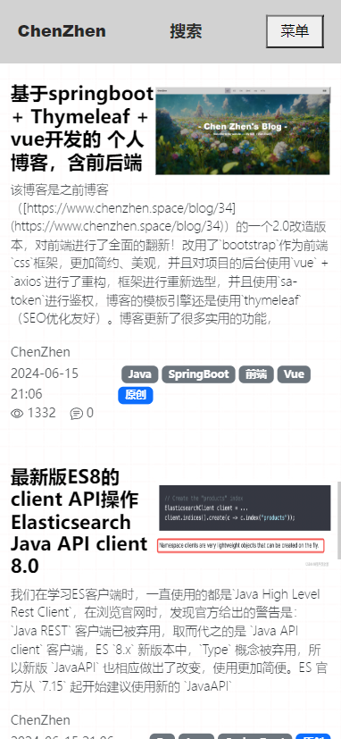

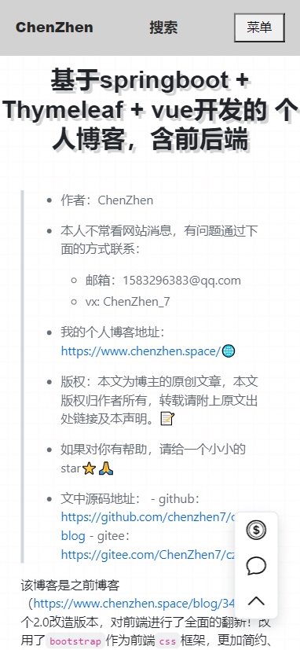

